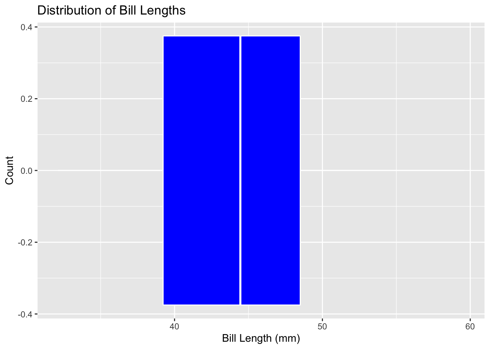
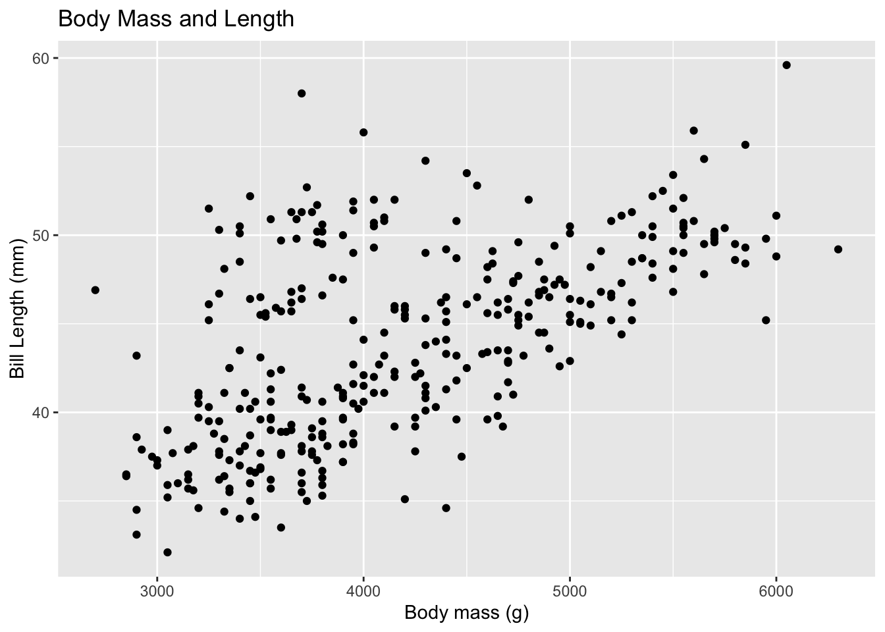
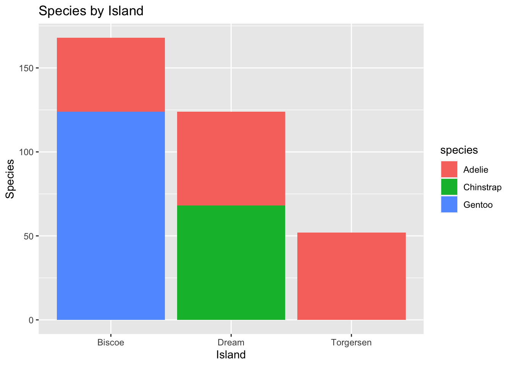

## Palmer Penguins

This is a test of Quarto functionality using the Palmer Penguins package.


::: {.cell}

```{.r .cell-code}
 library(tidyverse)
```

::: {.cell-output .cell-output-stderr}
```
Warning: replacing previous import 'lifecycle::last_warnings' by
'rlang::last_warnings' when loading 'pillar'
```
:::

::: {.cell-output .cell-output-stderr}
```
Warning: replacing previous import 'lifecycle::last_warnings' by
'rlang::last_warnings' when loading 'tibble'
```
:::

::: {.cell-output .cell-output-stderr}
```
Warning: replacing previous import 'lifecycle::last_warnings' by
'rlang::last_warnings' when loading 'hms'
```
:::

::: {.cell-output .cell-output-stderr}
```
── Attaching packages ─────────────────────────────────────── tidyverse 1.3.0 ──
```
:::

::: {.cell-output .cell-output-stderr}
```
✓ ggplot2 3.3.5     ✓ purrr   0.3.4
✓ tibble  3.1.4     ✓ dplyr   1.0.7
✓ tidyr   1.1.3     ✓ stringr 1.4.0
✓ readr   2.0.1     ✓ forcats 0.5.0
```
:::

::: {.cell-output .cell-output-stderr}
```
── Conflicts ────────────────────────────────────────── tidyverse_conflicts() ──
x dplyr::filter() masks stats::filter()
x dplyr::lag()    masks stats::lag()
```
:::

```{.r .cell-code}
    library(palmerpenguins)
    
    penguins %>% head()
```

::: {.cell-output .cell-output-stdout}
```
# A tibble: 6 × 8
  species island bill_length_mm bill_depth_mm flipper_length_… body_mass_g sex  
  <fct>   <fct>           <dbl>         <dbl>            <int>       <int> <fct>
1 Adelie  Torge…           39.1          18.7              181        3750 male 
2 Adelie  Torge…           39.5          17.4              186        3800 fema…
3 Adelie  Torge…           40.3          18                195        3250 fema…
4 Adelie  Torge…           NA            NA                 NA          NA <NA> 
5 Adelie  Torge…           36.7          19.3              193        3450 fema…
6 Adelie  Torge…           39.3          20.6              190        3650 male 
# … with 1 more variable: year <int>
```
:::
:::


This code loads the `palmerpenguins` package and displays the top (or `head`) of the dataset.

## Data Manipulation

In this section, we will use R code to manipulate data. In particular, we'll learn how to filter rows, subset columns, group data, and compute summary statistics.

Questions to answer:

-   Does bill length vary by species?

-   Does mass vary by year?

-   Which penguin species are the largest?

    ### Frequency Tables


::: {.cell}

```{.r .cell-code}
penguins %>%
  count(island)
```

::: {.cell-output .cell-output-stdout}
```
# A tibble: 3 × 2
  island        n
  <fct>     <int>
1 Biscoe      168
2 Dream       124
3 Torgersen    52
```
:::
:::


The above code produces a frequency table of penguins by island.


::: {.cell}

```{.r .cell-code}
penguins %>%
  count(species)
```

::: {.cell-output .cell-output-stdout}
```
# A tibble: 3 × 2
  species       n
  <fct>     <int>
1 Adelie      152
2 Chinstrap    68
3 Gentoo      124
```
:::
:::


The above code produces a frequency table of penguins by species.


::: {.cell}

```{.r .cell-code}
penguins %>% 
  count(island, species)
```

::: {.cell-output .cell-output-stdout}
```
# A tibble: 5 × 3
  island    species       n
  <fct>     <fct>     <int>
1 Biscoe    Adelie       44
2 Biscoe    Gentoo      124
3 Dream     Adelie       56
4 Dream     Chinstrap    68
5 Torgersen Adelie       52
```
:::
:::


The above code produces a frequency table for penguin species by island.


::: {.cell}

```{.r .cell-code}
penguins %>%
  count(island, species) %>%
  pivot_wider(names_from = species, values_from = n, values_fill = 0)
```

::: {.cell-output .cell-output-stdout}
```
# A tibble: 3 × 4
  island    Adelie Gentoo Chinstrap
  <fct>      <int>  <int>     <int>
1 Biscoe        44    124         0
2 Dream         56      0        68
3 Torgersen     52      0         0
```
:::
:::


The code above changes the format of the table so that it is more readable.

To create an even better table, install and load the `kableExtra` package:


::: {.cell}

```{.r .cell-code}
library(kableExtra)
```

::: {.cell-output .cell-output-stderr}
```

Attaching package: 'kableExtra'
```
:::

::: {.cell-output .cell-output-stderr}
```
The following object is masked from 'package:dplyr':

    group_rows
```
:::
:::


Create a frequency table for penguins species by island using the `kableExtra` package:


::: {.cell}

```{.r .cell-code}
penguins %>%
  count(island, species) %>%
  pivot_wider(names_from = species, values_from = n, values_fill = 0) %>%
  kable() %>%
  kable_styling(bootstrap_options = c("hover", "striped"))
```

::: {.cell-output-display}

`````{=html}
<table class="table table-hover table-striped" style="margin-left: auto; margin-right: auto;">
 <thead>
  <tr>
   <th style="text-align:left;"> island </th>
   <th style="text-align:right;"> Adelie </th>
   <th style="text-align:right;"> Gentoo </th>
   <th style="text-align:right;"> Chinstrap </th>
  </tr>
 </thead>
<tbody>
  <tr>
   <td style="text-align:left;"> Biscoe </td>
   <td style="text-align:right;"> 44 </td>
   <td style="text-align:right;"> 124 </td>
   <td style="text-align:right;"> 0 </td>
  </tr>
  <tr>
   <td style="text-align:left;"> Dream </td>
   <td style="text-align:right;"> 56 </td>
   <td style="text-align:right;"> 0 </td>
   <td style="text-align:right;"> 68 </td>
  </tr>
  <tr>
   <td style="text-align:left;"> Torgersen </td>
   <td style="text-align:right;"> 52 </td>
   <td style="text-align:right;"> 0 </td>
   <td style="text-align:right;"> 0 </td>
  </tr>
</tbody>
</table>

`````

:::
:::


Compute the average bill length for all penguins:


::: {.cell}

```{.r .cell-code}
penguins %>%
  summarize(mean_bill_length_mm = mean(bill_length_mm))
```

::: {.cell-output .cell-output-stdout}
```
# A tibble: 1 × 1
  mean_bill_length_mm
                <dbl>
1                  NA
```
:::
:::


Tell R to ignore "N/A" values:


::: {.cell}

```{.r .cell-code}
penguins %>%
  summarize(mean_bill_length_mm = mean(bill_length_mm, na.rm = TRUE))
```

::: {.cell-output .cell-output-stdout}
```
# A tibble: 1 × 1
  mean_bill_length_mm
                <dbl>
1                43.9
```
:::
:::


Include the median, standard deviation, minimum, 25th percentile, 75th percentile, and maximum bill lengths as well:


::: {.cell}

```{.r .cell-code}
penguins %>%
  summarize(
    min_bill_length = min(bill_length_mm, na.rm = TRUE),
    first_quartile_bill_length = quantile(bill_length_mm, 0.25, na.rm = TRUE),
    median_bill_length = median(bill_length_mm, na.rm = TRUE),
    mean_bill_length_mm = mean(bill_length_mm, na.rm = TRUE),
    third_quartile_bill_length = quantile(bill_length_mm, 0.75, na.rm = TRUE),
    standard_deviation_bill_length = sd(bill_length_mm, na.rm = TRUE)
    ) %>%
  pivot_longer(cols = everything())
```

::: {.cell-output .cell-output-stdout}
```
# A tibble: 6 × 2
  name                           value
  <chr>                          <dbl>
1 min_bill_length                32.1 
2 first_quartile_bill_length     39.2 
3 median_bill_length             44.4 
4 mean_bill_length_mm            43.9 
5 third_quartile_bill_length     48.5 
6 standard_deviation_bill_length  5.46
```
:::
:::


Use kable to format the table:


::: {.cell}

```{.r .cell-code}
penguins %>%
  summarize(
    min_bill_length = min(bill_length_mm, na.rm = TRUE),
    first_quartile_bill_length = quantile(bill_length_mm, 0.25, na.rm = TRUE),
    median_bill_length = median(bill_length_mm, na.rm = TRUE),
    mean_bill_length_mm = mean(bill_length_mm, na.rm = TRUE),
    third_quartile_bill_length = quantile(bill_length_mm, 0.75, na.rm = TRUE),
    standard_deviation_bill_length = sd(bill_length_mm, na.rm = TRUE)
    ) %>%
  pivot_longer(cols = everything()) %>%
  kable() %>%
  kable_styling(bootstrap_options = c("hover", "striped"))
```

::: {.cell-output-display}

`````{=html}
<table class="table table-hover table-striped" style="margin-left: auto; margin-right: auto;">
 <thead>
  <tr>
   <th style="text-align:left;"> name </th>
   <th style="text-align:right;"> value </th>
  </tr>
 </thead>
<tbody>
  <tr>
   <td style="text-align:left;"> min_bill_length </td>
   <td style="text-align:right;"> 32.100000 </td>
  </tr>
  <tr>
   <td style="text-align:left;"> first_quartile_bill_length </td>
   <td style="text-align:right;"> 39.225000 </td>
  </tr>
  <tr>
   <td style="text-align:left;"> median_bill_length </td>
   <td style="text-align:right;"> 44.450000 </td>
  </tr>
  <tr>
   <td style="text-align:left;"> mean_bill_length_mm </td>
   <td style="text-align:right;"> 43.921930 </td>
  </tr>
  <tr>
   <td style="text-align:left;"> third_quartile_bill_length </td>
   <td style="text-align:right;"> 48.500000 </td>
  </tr>
  <tr>
   <td style="text-align:left;"> standard_deviation_bill_length </td>
   <td style="text-align:right;"> 5.459584 </td>
  </tr>
</tbody>
</table>

`````

:::
:::


### Selecting specific columns and rows

We can select specific columns (using the `select()` function) or rows satisfying certain conditions (using the `filter()` function). For example, we can select only the `species`, `island`, `sex`, and `year` columns.


::: {.cell}

```{.r .cell-code}
penguins %>%
  select(species, island, sex, year)
```

::: {.cell-output .cell-output-stdout}
```
# A tibble: 344 × 4
   species island    sex     year
   <fct>   <fct>     <fct>  <int>
 1 Adelie  Torgersen male    2007
 2 Adelie  Torgersen female  2007
 3 Adelie  Torgersen female  2007
 4 Adelie  Torgersen <NA>    2007
 5 Adelie  Torgersen female  2007
 6 Adelie  Torgersen male    2007
 7 Adelie  Torgersen female  2007
 8 Adelie  Torgersen male    2007
 9 Adelie  Torgersen <NA>    2007
10 Adelie  Torgersen <NA>    2007
# … with 334 more rows
```
:::
:::


We can use `filter()` to include only `Chinstrap` penguins.


::: {.cell}

```{.r .cell-code}
penguins %>%
  select(species, island, sex, year) %>%
  filter(species == "Chinstrap")
```

::: {.cell-output .cell-output-stdout}
```
# A tibble: 68 × 4
   species   island sex     year
   <fct>     <fct>  <fct>  <int>
 1 Chinstrap Dream  female  2007
 2 Chinstrap Dream  male    2007
 3 Chinstrap Dream  male    2007
 4 Chinstrap Dream  female  2007
 5 Chinstrap Dream  male    2007
 6 Chinstrap Dream  female  2007
 7 Chinstrap Dream  female  2007
 8 Chinstrap Dream  male    2007
 9 Chinstrap Dream  female  2007
10 Chinstrap Dream  male    2007
# … with 58 more rows
```
:::
:::


We can \*de\*-select the species column using the `select()` function and a minus (`-`) sign in front of the column name. We can also store this smaller data frame into a new object called `chinstraps` by using the arror (`<-`) operator.


::: {.cell}

```{.r .cell-code}
chinstraps <- penguins %>%
  select(species, island, sex, year) %>%
  filter(species == "Chinstrap") %>%
  select(-species)

chinstraps %>%
  head()
```

::: {.cell-output .cell-output-stdout}
```
# A tibble: 6 × 3
  island sex     year
  <fct>  <fct>  <int>
1 Dream  female  2007
2 Dream  male    2007
3 Dream  male    2007
4 Dream  female  2007
5 Dream  male    2007
6 Dream  female  2007
```
:::
:::


### Grouping and Summarizing Groups

We can use `group_by()` and `summarize()` to quickly compare summary statistics across groups. Let's compare the average and standard deviation in `bill_depth_mm` across the species groups.


::: {.cell}

```{.r .cell-code}
penguins %>%
  group_by(species) %>%
  summarise(
    mean_bill_depth_mm = mean(bill_depth_mm, na.rm = TRUE),
    sd_bill_depth_mm = sd(bill_depth_mm, na.rm = TRUE)
  )
```

::: {.cell-output .cell-output-stdout}
```
# A tibble: 3 × 3
  species   mean_bill_depth_mm sd_bill_depth_mm
  <fct>                  <dbl>            <dbl>
1 Adelie                  18.3            1.22 
2 Chinstrap               18.4            1.14 
3 Gentoo                  15.0            0.981
```
:::
:::


The above code shows that Adelie and Chinstrap penguins have similar bill depths, but Gentoo penguins appear to have smaller bill depths.

## Data Visualization with `ggplot()`

This is in introduction to data visualization with `ggplot()`.

## Categorical variables

We can visualize categorical variables with a barplot:


::: {.cell}

```{.r .cell-code}
penguins %>%
  ggplot() +
  geom_bar(mapping = aes(x = species)) +
  labs(title ="Counts of Penguin Species",
       x = "Species", y = "Count")
```

::: {.cell-output-display}
{width=672}
:::
:::


Plot of penguins by island:


::: {.cell}

```{.r .cell-code}
penguins %>%
  ggplot() +
  geom_bar(mapping = aes(x = island)) +
  labs(title ="Counts of Penguins by Island",
       x = "Island", y = "Count")
```

::: {.cell-output-display}
{width=672}
:::
:::


### Numerical Variables

We can visualize a single numerical variable with a histogram (`geom_histogram()`), density (`geom_density()`), or boxplot (`geom_boxplot()`).


::: {.cell}

```{.r .cell-code}
penguins %>%
  ggplot() +
  geom_histogram(mapping = aes(x = bill_length_mm),
                 color = "white",
                 fill = "blue") +
  labs(title ="Distribution of Bill Lengths",
       x = "Bill Length (mm)", y = "Count")
```

::: {.cell-output .cell-output-stderr}
```
`stat_bin()` using `bins = 30`. Pick better value with `binwidth`.
```
:::

::: {.cell-output .cell-output-stderr}
```
Warning: Removed 2 rows containing non-finite values (stat_bin).
```
:::

::: {.cell-output-display}
{width=672}
:::
:::


The above code produces a histogram of bill length. It appears to be a bi-modal distribution.

Visualize bill length as a boxplot:


::: {.cell}

```{.r .cell-code}
penguins %>%
  ggplot() +
  geom_boxplot(aes(x = bill_length_mm),
                 color = "white",
                 fill = "blue") +
  labs(title ="Distribution of Bill Lengths",
       x = "Bill Length (mm)", y = "Count")
```

::: {.cell-output .cell-output-stderr}
```
Warning: Removed 2 rows containing non-finite values (stat_boxplot).
```
:::

::: {.cell-output-display}
{width=672}
:::
:::


### Two Numerical Variables

We can explore a potential relationship between two numerical variables with a scatterplot.


::: {.cell}

```{.r .cell-code}
penguins %>%
  ggplot() +
  geom_point(mapping = aes(x = bill_depth_mm, y = bill_length_mm)) +
  labs(title = "Bill Depth and Length",
       x = "Bill Depth (mm)",
       y = "Bill Length (mm)")
```

::: {.cell-output .cell-output-stderr}
```
Warning: Removed 2 rows containing missing values (geom_point).
```
:::

::: {.cell-output-display}
{width=672}
:::
:::


Bill length may be correlated with depth, but it is not a clear correlation.

See if body mass is correlated with bill length:


::: {.cell}

```{.r .cell-code}
penguins %>%
  ggplot() +
  geom_point(mapping = aes(x = body_mass_g, y = bill_length_mm)) +
  labs(title = "Body Mass and Length",
       x = "Body mass (g)",
       y = "Bill Length (mm)")
```

::: {.cell-output .cell-output-stderr}
```
Warning: Removed 2 rows containing missing values (geom_point).
```
:::

::: {.cell-output-display}
{width=672}
:::
:::


Body mass and bill length appear to have a much stronger correlation!

### Two Categorical Variables

We can explore potential associations between pairs of categorical variables using barplots and fill.


::: {.cell}

```{.r .cell-code}
penguins %>%
  ggplot() +
  geom_bar(mapping = aes(x = island, fill = species)) +
  labs(title = "Species by Island",
       x = "Island",
       y = "Species")
```

::: {.cell-output-display}
{width=672}
:::
:::


The above plot shows that the species of penguins varies by island, but Adelie penguins are found on all three islands.

### One Numerical and One Categorical Variable

We can also ompare a numerical variable and a categorical variable using side-by-side boxplots, or faceted plots.


::: {.cell}

```{.r .cell-code}
penguins %>%
  ggplot() +
  geom_boxplot(mapping = aes(x = bill_depth_mm, y = species)) +
  labs(title = "Bill Depth by Species",
       x = "Bill Depth (mm)",
       y = "")
```

::: {.cell-output .cell-output-stderr}
```
Warning: Removed 2 rows containing non-finite values (stat_boxplot).
```
:::

::: {.cell-output-display}
{width=672}
:::

```{.r .cell-code}
penguins %>%
  ggplot() +
  geom_histogram(mapping = aes(x = bill_depth_mm)) +
  facet_wrap(~species, ncol = 1) +
  labs(title = "Bill Depth by Species",
       x = "Bill Depth (mm)",
       y = "")
```

::: {.cell-output .cell-output-stderr}
```
`stat_bin()` using `bins = 30`. Pick better value with `binwidth`.
```
:::

::: {.cell-output .cell-output-stderr}
```
Warning: Removed 2 rows containing non-finite values (stat_bin).
```
:::

::: {.cell-output-display}
{width=672}
:::
:::


The above plot shows that Adelie and Chinstrap penguins have similar distributions of bill depth, but Gentoo penguois have smaller bill depths. It gives more insight on the differences between penguins rather than just comparing means.

## Advanced plotting

In this section, we will explore creating more complex plots. See the example below:


::: {.cell}

```{.r .cell-code}
penguins %>%
  filter(!is.na(sex)) %>%
  ggplot() +
  geom_point(mapping = aes(x = bill_length_mm, 
                           y = flipper_length_mm,
                           color = species,
                           shape = sex)) +
  geom_smooth(mapping = aes(x = bill_length_mm,
                            y = flipper_length_mm,
                            color = species)) +
  facet_grid(rows = vars(island), cols = vars(sex), scales = "free") +
  labs(title = "Flipper and Bill Lengths by Species and Sex",
       x = "Bill Length (mm)",
       y = "Flipper Length(mm)") +
  theme_light()
```

::: {.cell-output .cell-output-stderr}
```
`geom_smooth()` using method = 'loess' and formula 'y ~ x'
```
:::

::: {.cell-output-display}
{width=672}
:::
:::
